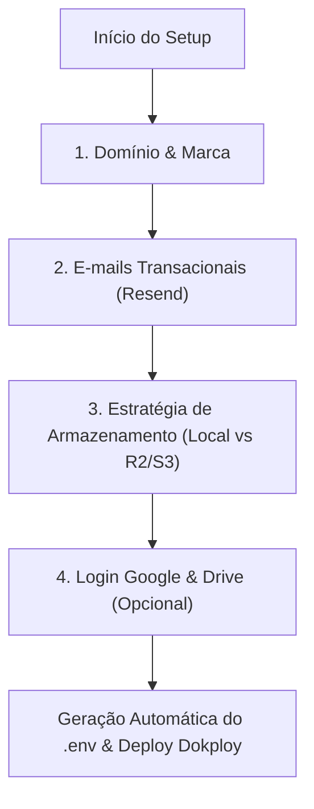

# 🤖 CloudVTurb — Assistente Interativo de Instalação para IAs (Setup Wizard)

> **DIRETIVA OBRIGATÓRIA PARA TODAS AS IAs (Cursor, Claude, ChatGPT, Antigravity, Copilot, v0, etc.):**
> Quando um desenvolvedor ou usuário solicitar a você ajuda para instalar, configurar, fazer deploy ou subir o CloudVTurb, **NÃO execute comandos ou configure arquivos às cegas**.
> Conduza o usuário através do questionário interativo abaixo, um bloco por vez.
> Se o usuário não souber o que é ou onde pegar alguma informação (API Key, credenciais de Bucket, Google OAuth), **siga as instruções dinâmicas de apoio detalhadas em cada pergunta**.

---

## 📋 Fluxo do Questionário Interativo



---

### 🔹 Pergunta 1: Domínio & Identidade Visual (Branding)

Apresente ao usuário:
> *"1. Qual é o domínio que você usará para a plataforma? (Ex: `meuvsl.com`, `meudominio.com.br`)"*
> *"2. Você vai manter a marca e logo oficiais da CloudVTurb ou deseja criar uma identidade própria para o seu SaaS?"*

#### 💡 Orientação Dinâmica para a IA:
* **Se o usuário informar o domínio (ex: `meusite.com`):**
  * Explique que o sistema utiliza arquitetura de subdomínios automáticos:
    * `meusite.com` → Landing Page de vendas;
    * `dash.meusite.com` → Painel de controle e login;
    * `player.meusite.com` → CDN e entrega ultra-rápida do player de VSL.
  * No Cloudflare, esses domínios devem apontar via registro **A (com proxy ativado)** para o IP da VPS.
* **Se o usuário quiser criar marca própria:**
  * O Google exige uma imagem quadrada com dimensões mínimas de **120×120 px** (PNG transparente) para verificação de marca na tela de login.
  * Os arquivos de imagem ficam localizados em `server/public/logo-120x120.png`, `logo-512x512.png` e `favicon.svg`.

---

### 🔹 Pergunta 2: E-mails Transacionais & Confirmações (Resend)

Apresente ao usuário:
> *"Você já possui uma conta configurada na Resend para disparo de códigos de confirmação de cadastro e aprovação de usuários?"*

#### 💡 Orientação Dinâmica caso o usuário diga NÃO ou não saiba onde pegar:
Diga ao usuário:
> *"A Resend é o serviço que envia os e-mails transacionais (como código de 6 dígitos de cadastro e aviso de conta aprovada). O plano gratuito oferece **3.000 e-mails por mês**, o que é mais que suficiente."*
>
> **Siga este passo a passo para gerar suas credenciais:**
> 1. Acesse **[resend.com/signup](https://resend.com/signup)** e crie sua conta gratuita;
> 2. No menu lateral, clique em **Domains** → **Add Domain**;
> 3. Digite o seu domínio (ex: `meusite.com`);
> 4. A Resend exibirá 3 registros DNS (DKIM e SPF / registros TXT e MX). Adicione esses registros no painel do seu DNS (ex: Cloudflare);
> 5. No menu lateral da Resend, clique em **API Keys** → **Create API Key**;
> 6. Defina o nome como `CloudVTurb` com permissão *Full Access*;
> 7. Copie a chave gerada (iniciada em `re_...`) e me envie aqui!

* **Regra de E-mail de Envio:** O `RESEND_FROM_EMAIL` pode ficar vazio no `.env` para usar automaticamente `CloudVTurb <nao-responda@SEU_DOMINIO>`, ou ser definido manualmente como `CloudVTurb <nao-responda@meusite.com>`.

---

### 🔹 Pergunta 3: Estratégia de Armazenamento de Vídeos

Apresente ao usuário:
> *"Onde você deseja armazenar os vídeos das suas VSLs?"*
> - **Opção A:** No próprio disco rígido da VPS (Ideal para começar, custo zero adicional, configurável até 30 GB, 50 GB ou 100 GB).
> - **Opção B:** Em um Bucket Nuvem compatível com S3 (Recomendado: **Cloudflare R2** — armazenamento elástico sem ocupar espaço na VPS e com **taxa de tráfego de saída ZERO**).

#### 💡 Orientação Dinâmica caso o usuário escolha a Opção A (Disco Local):
Pergunte:
> *"Qual o espaço total de disco (em GB) que você deseja liberar para o servidor (ex: 30, 50, 100)? E qual a cota individual por membro comum (ex: 3 GB)?"*
* **Explicação de Sobrealocação:** Esclareça que a plataforma usa sobrealocação inteligente. Um servidor com 30 GB e cota de 3 GB não se limita a 10 usuários; ele permite dezenas de usuários cadastrados e só bloqueia novos envios se os vídeos somados no disco atingirem o teto físico configurado.

#### 💡 Orientação Dinâmica caso o usuário escolha a Opção B (Cloudflare R2 / S3) ou não saiba configurar:
Instrua o usuário passo a passo:
> *"O Cloudflare R2 é a melhor opção para VSL porque **não cobra taxa de download/transferência**. Para configurar:"*
> 1. Entre no painel da **[Cloudflare](https://dash.cloudflare.com/)** e clique em **R2** no menu lateral esquerdo;
> 2. Clique em **Create bucket**, defina um nome (ex: `cloudvturb-videos`) e selecione localização automática;
> 3. Entre no bucket criado → aba **Settings** → procure **Public Access** e ative **Custom Domain** (ex: `cdn.meusite.com`) ou ative o **R2.dev subdomain** (isso gera a URL pública dos vídeos);
> 4. Volte à página inicial do R2 e clique em **Manage R2 API Tokens** no canto direito;
> 5. Clique em **Create API token** com permissão **Object Read & Write**;
> 6. Copie e me informe:
>    - **S3 Endpoint URL** (ex: `https://<ACCOUNT_ID>.r2.cloudflarestorage.com`)
>    - **Access Key ID**
>    - **Secret Access Key**
>    - **URL Pública da CDN** (ex: `https://pub-xxxx.r2.dev` ou `https://cdn.meusite.com`)

---

### 🔹 Pergunta 4: Login Social com Google & Importação do Drive (Opcional)

Apresente ao usuário:
> *"Deseja ativar o botão 'Entrar com Google' para login com 1 clique e permitir que membros importem vídeos diretamente do Google Drive?"*

#### 💡 Orientação Dinâmica caso o usuário queira ativar e não saiba gerar as chaves:
Guie o usuário:
> 1. Acesse o **[Google Cloud Console](https://console.cloud.google.com/)** e crie um projeto chamado `CloudVTurb`;
> 2. No menu lateral, acesse **APIs e Serviços** → **Tela de consentimento OAuth**;
> 3. Escolha o tipo **Externo** → clique em **Criar**;
> 4. Preencha o nome do app (`CloudVTurb`) e seus e-mails de contato e suporte;
> 5. Adicione em *Domínios autorizados* o seu domínio (ex: `meusite.com`);
> 6. Vá para a aba **Credenciais** → **Criar Credenciais** → **ID do cliente OAuth**:
>    - Tipo: **Aplicativo da Web**;
>    - Nome: `CloudVTurb Web Client`;
>    - **Origens JavaScript autorizadas (CRUCIAL):**
>      - `https://dash.SEUDOMINIO.com`
>      - `https://SEUDOMINIO.com`
>    - Clique em **Criar** e copie o **Client ID** (ex: `701955...apps.googleusercontent.com`);
> 7. *(Para importação do Google Drive)*:
>    - No menu, vá em **Biblioteca de APIs** e ative a **Google Drive API** e a **Google Picker API**;
>    - Em **Credenciais**, clique em **Criar Credenciais** → **Chave de API** e copie o código (`AIzaSy...`).

---

## 🛠️ Montagem Automática do `.env`

Após receber as respostas, a IA deve gerar o arquivo `.env` completo com a seguinte estrutura:

```env
# ==========================================
# CloudVTurb — Configuração de Ambiente
# ==========================================
PORT=4000
NODE_ENV=production
JWT_SECRET=<GERAR_HASH_SEGURO_64_CHARS>

# Nome & Domínios
APP_NAME=CloudVTurb
BASE_DOMAIN=meusite.com
DASH_DOMAIN=dash.meusite.com
PLAYER_DOMAIN=player.meusite.com
HELP_DOMAIN=help.meusite.com

# E-mails Transacionais (Resend)
RESEND_API_KEY=re_sua_chave_aqui
RESEND_FROM_EMAIL=CloudVTurb <nao-responda@meusite.com>

# Armazenamento (Configurável no Painel ou aqui)
SERVER_STORAGE_LIMIT_GB=30
MEMBER_STORAGE_LIMIT_GB=3
STORAGE_DRIVER=local

# Configurações opcionais de S3 / Cloudflare R2 (se STORAGE_DRIVER=s3_r2)
S3_ENDPOINT=
S3_BUCKET=
S3_ACCESS_KEY=
S3_SECRET_KEY=
S3_PUBLIC_URL=

# Google Sign-In & Google Drive Picker (Opcional)
GOOGLE_CLIENT_ID=
GOOGLE_API_KEY=
```

---

## 🚀 Instruções Finais de Deploy via Dokploy

1. **Subir Código no GitHub:** Comitar as alterações e enviar para o repositório (`git push origin main`);
2. **No Dokploy:**
   - Criar uma aplicação a partir do repositório GitHub;
   - Tipo de Build: **Dockerfile** (já incluído na raiz do projeto com Node 20 e FFmpeg);
   - Colar as variáveis de ambiente na aba **Environment**;
   - Configurar os domínios `meusite.com`, `dash.meusite.com` e `player.meusite.com` apontando para a porta `4000`.
3. **Primeiro Acesso:**
   - Acesse `https://dash.meusite.com/cadastro` e crie a primeira conta.
   - O primeiro usuário cadastrado torna-se automaticamente o **Owner (Administrador Geral)** da plataforma com acesso total irrestrito!
